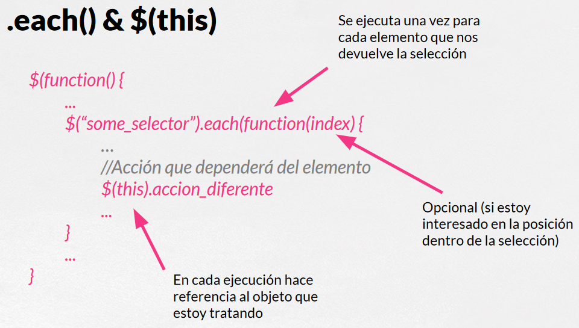

# jQuery

## Instalación de jQuery

### En local

Página de descarga: [https://jquery.com/download/](https://jquery.com/download/)\
Se descarga la versión comprimida (min.js) y se guarda en un directorio accesible desde la web.\
El enlace al archivo js desde la cabecera de la web se coloca en el `head`.

```html
<!DOCTYPE html>
<html lang="es">

<head>
    <meta charset="UTF-8">
    <meta name="viewport" content="width=device-width, initial-scale=1.0">
    <title>Instalación local</title>
    <script src="js/jquery-3.7.1.min.js"></script>
</head>

<body>
    <h1>Instalación de jQuery en local</h1>

    <script>
        $(function(){

        });
    </script>
</body>

</html>
```

### En remoto

Se hace uso de los **cdn** de **Google** como librería, no como servicio.\
[https://developers.google.com/speed/libraries?hl=es-419](https://developers.google.com/speed/libraries?hl=es-419)

```html
<!DOCTYPE html>
<html lang="es">
<head>
    <meta charset="UTF-8">
    <meta name="viewport" content="width=device-width, initial-scale=1.0">
    <title>jQuery remoto</title>
    <script src="https://ajax.googleapis.com/ajax/libs/jquery/3.7.1/jquery.min.js"></script>
</head>
<body>    
    <h1>Instalación de jQuery en remoto</h1>

    <script>
        $(function(){

        });
    </script>
</body>
</html>
```

### Comprobar si jQuery se ha cargado

Ejecutar en la consola:

```js
$();
```

o

```js
jQuery
```

### Ejecución de las funciones con jQuery

Al final del body se carga el script

```js
<scrip>
    $(document).ready(function(){
        ...
    });
</script>
```

o

```js
<script>
    $(function(){
        ...
    });
</script>
```

## SELECTORES

```js
<script>
    $(function(){
        
        // $("selector").accion()
        $("*").hide();     // Selector universal. Esconde todo.
        $("img").hide();         // Oculta los elementos .
        $("img").eq(1).hide();     // El primer elemento .
        $("th#ejemplo").hide();  // Oculta th con id "ejemplo".
        $(".card").hide();           // Oculta la clase "card".
        $("h1,h2,h3").hide(); // Selección de varios elementos.
        $("input[type='text']").hide(); // Input de tipo texto.

    });
</script>
```

### PSEUDO-SELECTORES

```js
<script>
    $(function(){
        
        // :hover
        // :visited
        // :first-of-type / :first-child
        // :last-of-type / :last-child
        // :nth-of-type / :nth-child
        // :required
        $("ul.iconos .li:first-child").hide();
        $("ul.iconos .li:nth-child(3)").hide();

    });
</script>
```

### SELECTORES CSS

```js
<script>

    $(function(){
        
        // seleccionar la primera columna del cuerpo de una tabla
        $("tbody tr td:first-child");
        $("tbody tr rd:fist-of-type");

        // El primer elemento de una lista
        $(".iconized li:nth-child(1)");
        $(".iconized li").eq(0);

        // El campo de un formulario anterior al submit
        $("input:last-of-type");

        // El último elemnento de una lista poner en rojo
        $(".iconized li-last-cild").css("color","red");

        // La última imagen de una página
        $("body img:last-of-type");

        // La primera letra de un hx
        $("h1:first-letter").css("transform","upper");

    });
</script>
```

### SELECTORES JQUERY

- `:eq(index)(eq() actual)`
- `:has("")`
- `:contains("")`
- `:even / :odd`
- `:input` (inputs, textarea, select, buttons)
- `:gt(index) / :lt(index)` mayor/menor que
- `:first / :last` (.first(), .last() actual)
- `:button, :file, :radio, :reset`
- `:submit, :text, :checkbox`
- `:password, :image`
- `:header` (hx)
- `:hidden, :visible`
- `:parent` selecciona aquello que tiene algo dentro

```js
<script>

    $(function(){
                
        $(":password");                  // seleccionar passwords
        $("text");             // seleccionar inputs de tipo text
        $(":h1");                     // seleccionar cabeceras h1
        $(":header");           // selecciona todas las cabeceras

        $("img:visible").hide(); // ocultar las imágenes visibles
        $("img:hidden").show();   // mostrar las imágenes ocultas

    });
</script>
```

## Each() and $(this)



### Recorrer una lista

```js
<script>

    $(function(){

        // Muestra el texto de cada elemento y lo cambia posteriormente
        $("li")each(function(index)){
            console.log("El elemento " + index + " contiene " + $(this).text());
            $(this).text("HOLA");
        }

    });

</script>
```

## CSS

```js
<script>

    $(function(){

        let valor = $("algun-selector").css("propiedad");
        $("algun-selector").css("propiedad","valor");

        // Establecer el valor de una propiedad para todos los elementos 
        // (una función para cada elemento devuelto por el selector).
        // En index está la posición en la lista de elementos devuelta por
        // el selector,y en value, el antiguo valor.
        $("algun-selector").css("propiedad",function(index,value){
            // $(this)
        });

        let color = $("li").css("color");  // Se devuelve el primer elemento encontrado
        $("img").css("width","+=50");

        // OBTENER el valor de varias propiedades DEL PRIMER ELEMENTO
        // que se obtiene del selector (array)
        let props = $("algun-selector").css([
            "propiedad1",
            "propiedad2",
            "propiedadn"
        ]);

        let colores = $("li").css(["color","background-color"]);

        // ESTABLECER el valor de varias propiedades para los
        // elementos seleccionados.
        // Entre las llaves se escribe el CSS con su propia sintaxis.
        $("algun-selector").css({
            prop1 : valor, // o expresión
            prop2 : valor, // o expresión
            propn : valor, // o expresión
        });

        $("li").css({
            color: #fff,
            background-color: #000;
        });


    });

</script>
```

### Funciones CSS adicionales

```js
<script>
    $(function(){

        // Getter y setter para algunos valores
        // $("...").width(); $("...").width(value);
        // $("...").height(); / $("...").height(value);
        $("img").eq(4).width("20px");
        $("img").width("20px");

        let size = $("img").eq(0).height();


    });
</script>
```

### Clases CSS

Para los elementos seleccionados:\
`.addClass()`\
`.removeClass()`\
`.toggleClass()` pone o quita la clase dependiendo de si la tiene o no.\
`.hasClass()`

```js
<script>
    $(function(){

        // Añadir varias clases
        $("button").addClass("btn btn-error");

        // Le pasamos una función que se aplica a cada elemento (con una
        // posición) y cuyo valor srá el nombre de la clase que se añade ($(this)).
        // Devuelve el nombre de la clase que se quiere añadir.
        $("section").addClass(funtion(index){
            return "section-" + index;
        });

        let has = $("tbody tr:first td").hasClass("una-clase");

    })
</script>
```

### Atributos CSS

- **Atributo**: nos da información adicional sobre un elemento HTML, con la forma nombre="valor".
- **Propiedad**: es información de la instancia concreta de una etiqueta, dentro de un DOM determinado.


#### Funciones para trabajar con atributos y propiedades

- No usar versiones anteriores a jQuery 1.6.
- Usar siempre que sea posible las funciones que hacen referencia a las propiedades.
- Usar .attr() únicamente cuando sean atributos *_custom*, es decir que no van a tener propiedades asociadas.

`.attr()`\
`.removeAttr()`\
`.prop()`\
`.removeProp()`

```js
<script>
    $(funtion(){
        // Obtener el valor del un atributo del primer elemento
        // let valor = $("algun-selector").attr("algun-atributo");
        let url = $("a").attr("href");

        // Fijar el valor de un atributo concreto en todos los
        // elementos seleccionados
        // $("algun-selector").attr("algun-atributo","nuevo-valor");
        $("a").attr("targe","_blank");

        // Fijar el valor de varios atributos a la vez en todos
        // los elementos seleccionados
        // $("algun-selector").attr({
        //     atr1 : value1,
        //     atr2 : value2,

        //     atrn : valuen,
        // });
        $("#miprofile").attr({
            alt   : "Foto de mi cara",
            title : "Foto hecha por mí"
        });

    });
</script>
```
